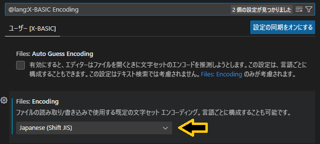
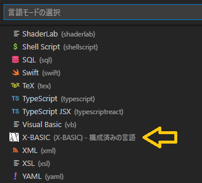
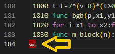
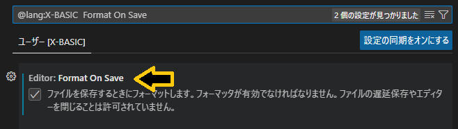
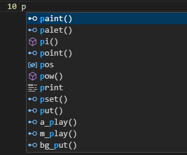
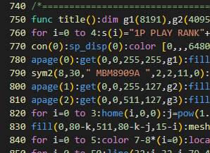
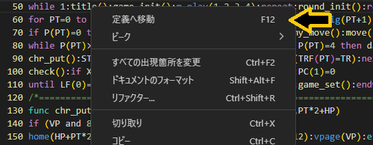

# X-BASIC extension for Visual Studio Code

Visual Studio Code用のX-BASIC言語拡張機能です。  
拡張子.BASに関連付けられ、X-BASIC言語のコード補完やハイライトなどを行います。

## インストール
メニュー[移動]から[ファイルに移動](Ctrl + P)を選んで、下記のコマンドを入力してインストールしてください。
~~~
ext install X-BASIC
~~~
### 設定
X-BASICのファイルはエンコードをSHIFT-JISで保存する必要があります。  
下記の設定を行うことで拡張子.BASのエンコードをSHIFT-JISに設定することができます。  
1. メニュー[表示]から[コマンドパレット](Ctrl + Shift + P)を選んで“Configure language specific settings”と入力します。  
2. 言語の選択でX-BASICを選択し、Encoding設定を[Japanese (Shift JIS)]に変更します。

## 機能

### X-BASIC言語モード  
拡張子.BASの場合、自動検出してX-BASIC言語モードになります。
Ctrl+K Mで手動で切り替えることもできます。

### フォーマッター機能  
ファイル末尾にEOFの付与を行います。  
X68000のX-BASICでloadする場合、ファイル末尾にEOFが必要になります。  
フォーマッターのデフォルトのショートカットキー(Shift + Alt + F)で動作します。  

また、Visual Studio CodeのFormat On Save設定で保存時に自動で行うこともできます。

### コード補完機能  
入力途中でマッチするX-BASICのステートメントや関数などを候補表示しコード入力を補完します。

### シンタックスハイライト / セマンティックハイライト  
ステートメントや関数など、下記の分類で色分けして表示します。  
行番号 / ステートメント / 関数 / システム変数 / コメント / コマンド / 定義関数 / カッコ / 数値 / 文字列  

funcで定義している関数については、ハイライトされている単語にカーソルを合わせF12キーまたは右クリックのメニューから定義位置へ移動することができます。

## リリースノート

### 0.0.1

初版
